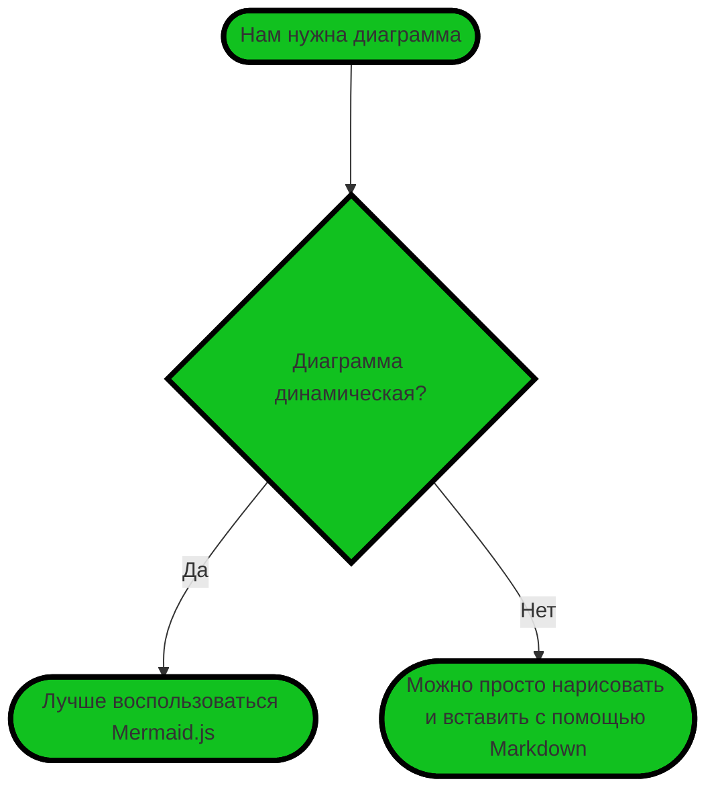

# Mermaid

> https://habr.com/ru/articles/652867/

```mermaid
flowchart TD
    classDef class1 fill:#11C11F, stroke:#000, stroke-width:4px

    A([Нам нужна диаграмма]):::class1
    B{Диаграмма динамическая?}:::class1
    A--->B
    B--Да-->C([Лучше воспользоваться Mermaid.js]):::class1 
    B--Нет-->D([Можно просто нарисовать и вставить с помощью Markdown]):::class1
```

---
<!-- %%{init: {"pie": {"textPosition": 0.7}, "themeVariables": {"pieOuterStrokeWidth": "5px"}} -->

```mermaid
%%{init: {"pie": {"textPosition": 0.7}, "themeVariables": {"pieOuterStrokeWidth": "4px"}} }%%
pie 
    showdata
    title "Продажи легких закусок за декабрь 2021"
    "Сендвичи" : 223
    "Салаты" : 1250
    "Канапе" : 100
```
